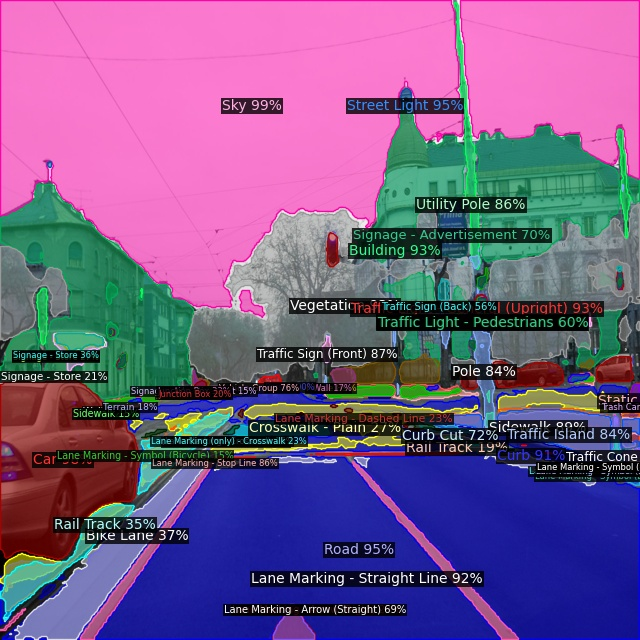
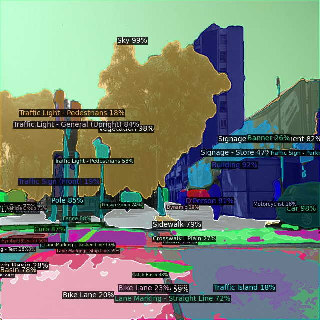
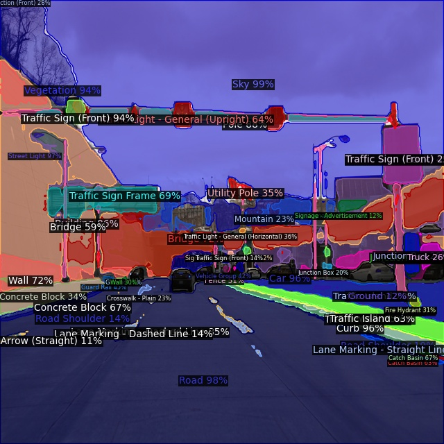
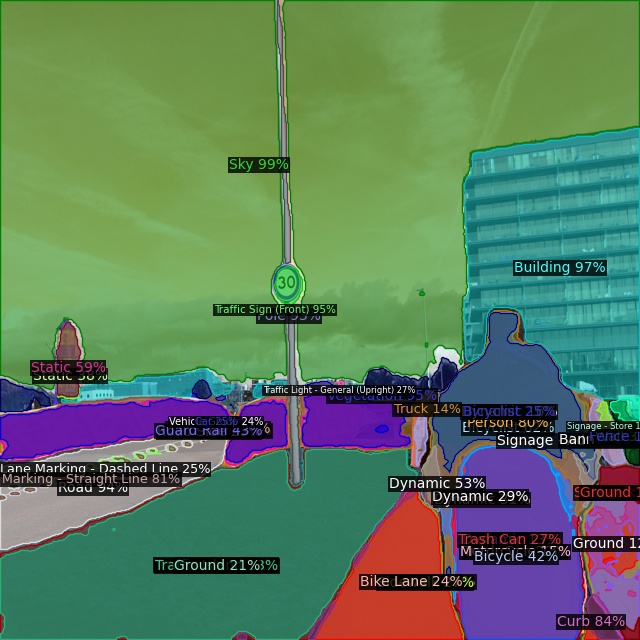
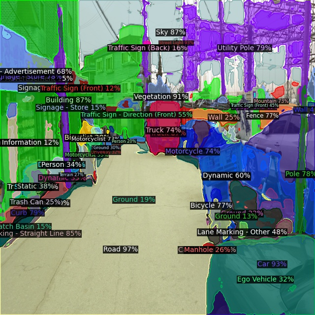
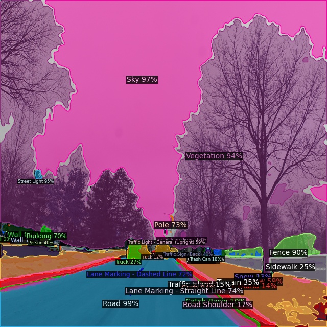

# [ITRI Internship] [NVIDIA TAO](https://developer.nvidia.com/tao-toolkit) Mask2Former Speedup
This project is a follow-up project to **Mask2Former_retrain**. 

## Why Speed Up?
Since the inference speed of the Mask2Former model is approximately 2-3 Hz with 720P images (on an RTX 6000 Ada GPU), it is too slow for real-world real-time applications. In practice, scenarios like autonomous driving or video analytics often require at least 15-30 Hz for timely and reliable responses. Without sufficient speed, important information may be missed or delayed, which can impact safety and performance. Therefore, accelerating the model is essential to meet real-time requirements.

## NVIDIA TAO Toolkit
Mask2Former model is speeding up with NVIDIA TAO Toolkit, which is an end-to-end AI model optimization and deployment platform designed to simplify and accelerate deep learning workflows. It enables efficient model pruning, quantization, and TensorRT integration, allowing the optimized model to achieve significantly faster inference on NVIDIA GPUs.

The repository is a part of [tao_tutorials](https://github.com/NVIDIA/tao_tutorials). The original path is `tao_tutorials/notebooks/tao_launcher_starter_kit/mask2former`.

<!-- ```bash
# to enter the main folder
cd mask2former/
``` -->

## Acceleration
This jupyter notebook file contains the main process on how to effectively speed up the Mask2Former model. However, if we wan to speed up the model through NVIDIA TAO Toolkit, we have to train the Mask2Former model with COCO-format dataset by using this jupyter notebook first. Models trained directly with the original Mask2Former repository are not compatible with TAO Toolkit for acceleration, because TAO requires models to follow its specific training and export pipeline. Therefore, to take advantage of TAO’s acceleration features, it is necessary to train the model within the TAO-supported environment as demonstrated in this notebook.

The merged dataset I organized is in Mapillary format (please refer to  **Mask2Former_retrain** project). You can follow the instructions provided by [Mapillary2COCO](https://github.com/Luodian/Mapillary2COCO) to transform the dataset from Mapillary format to COCO format. 

`mask2former.ipynb` clearly lists all the steps required to accelerate Mask2Former.

### 0. Set up env variables and map drives  
> The environment and directory-related settings. You can modify the working directory settings based on your needs.  

### 1. Installing the TAO Launcher  
> The commands for installing the TAO launcher only need to be run the first time you run this file.

### 2. Prepare Dataset and Download Pretrained Model

#### 2.1 Prepare Dataset
> - The **COCO dataset** will be downloaded after you run the commands in this step. 
> - Again, since the **COCO-format** dataset is needed for training the TAO Mask2Former model, if a custom dataset is used, please convert it to COCO format ([Mapillary2COCO](https://github.com/Luodian/Mapillary2COCO) is a useful repo.). 
> - The results shown at the end of this README is trained on the merged dataset I made in the **Mask2Former_retrain** project.

#### 2.2 Download Pretrained Model  
> This step will download the Swin-Tiny pretrained weight as backbone. You can change the backbone based on your needs. 

### 3. Provide Experiment Spec File  
> This step shows the contents of `specs.yaml`, where you can setup the training hyperparameters and dataset paths. 

### 4. Run TAO Training  
> Run TAO Mask2Former model training. 

### 5.~6. (Optional)  
> The steps include model evaluation and inference. If you are not interested in these steps, you can directly move on to step 7.

### 7. Deploy  
Before running this step, you have to move the trained TAO Mask2Former model `.pth` file from `mask2former/train/swin_tiny` to `experiments/` folder. 

This step will convert the `.pth` file to an `.onnx` file, and then to an `.engine` file. The `.onnx` file can be found in `experiments/export/` folder while the `.engine` file can be found in `experiments/gen_trt_engine/` folder. 

However, it is not recommended to convert the `.engine` file here if you want to deploy the accelerated mask2former model on `AArch64`-based computer in the future, as the TensorRT version on an `AArch64`-based computer differs from that on an `x86` platform. Therefore, a `.engine` file generated on `x86` cannot be used on an `AArch64`-based computer.

If you want to generate the TensorRT `.engine` file that is compatible with `AArch64`-based computer, please refer to ...


## Results
<table style="width: 100%; table-layout: fixed;">
  <tr>
    <td style="width: 50%; vertical-align: top;">
      <div style="width: 100%; text-align: center;">
        
        <!-- <div style="margin-top: 8px;">Mapillary</div> -->
      </div>
    </td>
    <td style="width: 50%; vertical-align: top;">
      <div style="width: 100%; text-align: center;">
        
        <!-- <div style="margin-top: 8px;">ADE20K</div> -->
      </div>
    </td>
  </tr>
  <tr>
    <td style="width: 50%; vertical-align: top;">
      <div style="width: 100%; text-align: center;">
        
        <!-- <div style="margin-top: 8px;">Cityscapes</div> -->
      </div>
    </td>
    <td style="width: 50%; vertical-align: top;">
      <div style="width: 100%; text-align: center;">
        
        <!-- <div style="margin-top: 8px;">COCO</div> -->
      </div>
    </td>
  </tr>
  <tr>
    <td style="width: 50%; vertical-align: top;">
      <div style="width: 100%; text-align: center;">
        
        <!-- <div style="margin-top: 8px;">Pascal VOC</div> -->
      </div>
    </td>
    <td style="width: 50%; vertical-align: top;">
      <div style="width: 100%; text-align: center;">
        
        <!-- <div style="margin-top: 8px;">KITTI</div> -->
      </div>
    </td>
  </tr>
</table>

The segmentation results show that the Mask2Former model trained by NVIDIA TAO Toolkit can segment the scene well which fulfill the application needs. 

## Related Porjects


## Acknowledgement
Code is largely based on tao_tutorials (https://github.com/NVIDIA/tao_tutorials).